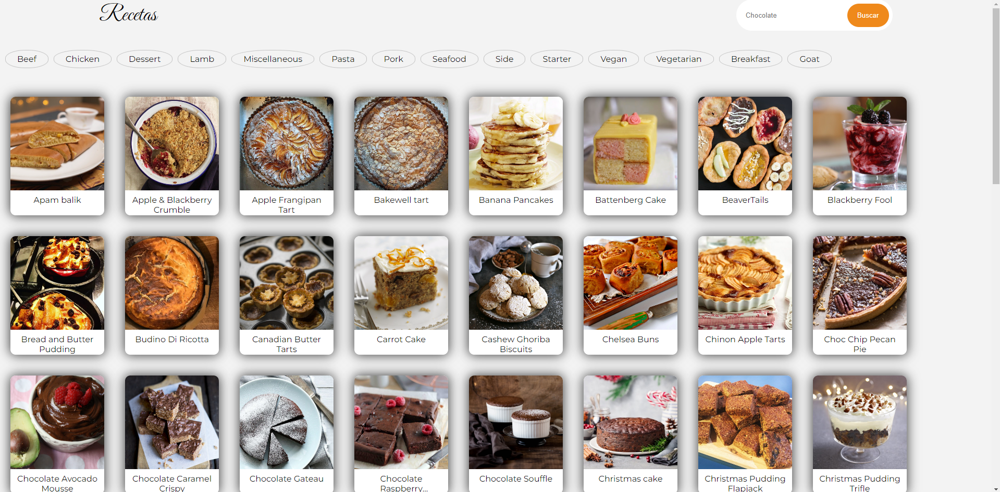

# PruebaTécnicaNativeApps

Este proyecto está realizado en [Angular 17.3.3](https://angular.dev/) y la versión de [NodeJs 20.12.1](https://nodejs.org/en)

## Instalación de librerías.

Para instalar las librerías del proyecto se puede usar `npm` o `yarn`, usando siguientes comandos:

```sh

# NPM
npm install

# YARN
yarn install

```

## Desplegar el proyecto en Dev-Local

Para desplegar el proyecto en Dev-Local se tiene que ejecutar el comando `npm start` o `yarn start`, tiene un script que asigna el puerto y abre automáticamente el proyecto en el explorador.


# Instrucciones y vista de la aplicación

Estas instrucciones son notas de la funcionalidad que se agrega y diseño.

## Home

El Home obtiene el servicio de categorías y las pinta en la parte de arriba como cards redondos, adicionalmente se obtiene las recetas de la categoría `Desert` por defecto, en caso de cambiar de categoría se selecciona alguna categoría y cambiará la información en pantalla.

Imagen de Referencia.


## Result-Search

La página de `Result-Search` hace una petición por cada letra ingresada en el campo de búsqueda, incluido que cambiará la url de la página mostrando un query de la búsqueda, en caso de que se copie la url y se pegue el otro navegador va a hacer la petición de la búsqueda de las recetas relacionadas con la palabra que esté en la url como `queryParams`.

## Details-Recipe

En esta parte tiene el mismo comportamiento que la página de `Result-Search`, se cargará la información de la receta relacionada al id que cargue en la url, al seleccionarlo automáticamente pondrá este ID y obtendrá la información del mismo, muestra los tags y la información más importante, incluido un link para redirigir al vídeo de YouTube en caso de no cargarse, a su vez en caso de ir a ver más detalles sobre la receta habrá un botón de ver más que lo llevará a la url que proporciona el servicio con esta receta.

